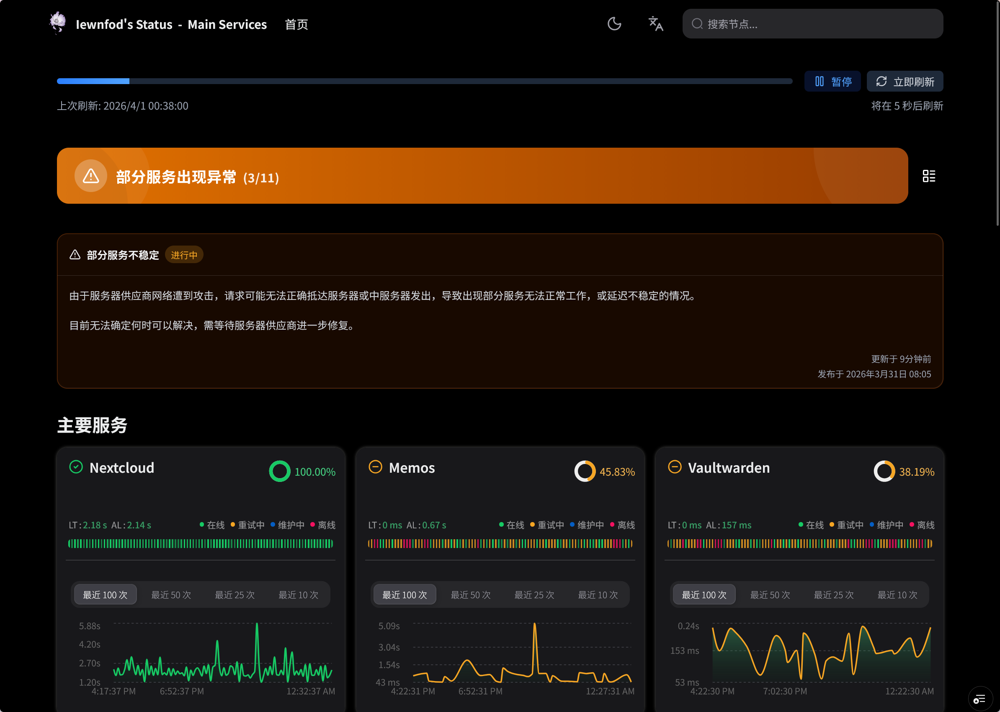
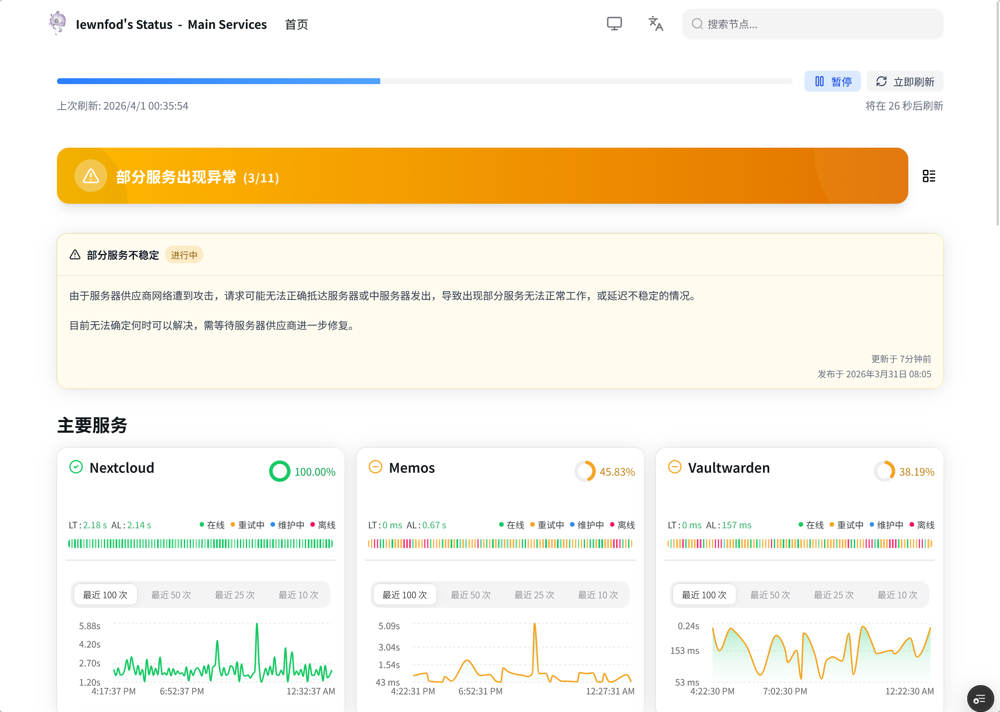

# Kuma Mieru :traffic_light:

Kuma Mieru 是一款基于 Next.js 16、TypeScript 和 Recharts 构建的第三方 Uptime Kuma 监控仪表盘。

本项目使用 Recharts 解决了 Uptime Kuma 内建公开状态页面不够直观、没有延迟图表等痛点。

中文 | [English](README.en.md)

<!-- Tech Stack -->

  
 

> 此分支通过人工代码审核修复了部分原版 Bug，并支持了 Uptime Kuma 的事件功能
> 
> 当前文档中的环境变量未经全部测试，如果存在无法正常运行，请及时上报

## 目录
- [目录](#menu)
- [测试截图 :camera:](#preview)
- [功能亮点 :sparkles:](#features)
- [快速部署 :star:](#quick-start)
  - [使用 Vercel 部署](#vercel)
- [环境变量配置](#env)
- [开源许可 :lock:](#license)

## 测试截图 :camera:
| Dark Mode                     | Light Mode                      |
|-------------------------------|---------------------------------|
|  |  |

## 功能亮点 :sparkles:
- **实时监控，自动刷新** :arrows_clockwise:：状态显示**实时更新**，无需手动刷新，随时掌握最新动态。
- **美观响应式界面** :art:：采用 **HeroUI 组件** 构建，界面更加现代，**完美适配**各种设备屏幕。
- **交互式图表** :chart_with_upwards_trend:：利用 **Recharts** 图表库实现数据可视化，可以 **交互式** 地查看各节点的延迟、状态等数据。
- **多主题支持** :bulb:：提供 **暗色** / **亮色** / **系统** 多种主题，满足不同偏好。
- **维护公告**：支持 Uptime Kuma 的 **事件公告** 和 **状态更新** 特性，实时同步更高效。

## 快速部署 :star:

### 使用 Vercel 部署

## 环境变量配置

首先，假设您的 Uptime Kuma 状态页面 URL 为:
`https://kuma.example.com/status/test`

推荐配置：
* `UPTIME_KUMA_BASE_URL=https://kuma.example.com`
* `PAGE_ID=test`

环境变量说明如下（含向后兼容）:

| 变量名                          | 必填  | 说明                                                                            | 示例/默认值                                                                                              |
| ------------------------------- | ----- | ------------------------------------------------------------------------------- | -------------------------------------------------------------------------------------------------------- |
| UPTIME_KUMA_BASE_URL            | Yes\* | 兼容旧版。Uptime Kuma 实例基础 URL（当未设置 `UPTIME_KUMA_URLS` 时启用）        | <https://example.kuma-mieru.invalid>                                                                     |
| PAGE_ID                         | Yes\* | 兼容旧版。状态页 ID，支持逗号分隔多个页面（当未设置 `UPTIME_KUMA_URLS` 时启用） | default,status-asia                                                                                      |
| UPTIME_KUMA_URLS                | Yes\* | 推荐。完整状态页 URL，支持使用 `\|` 分隔多个 URL（可来自不同 Kuma 实例）        | <https://example.kuma-mieru.invalid/status/default\|https://example.kuma-mieru.invalid/status/secondary> |
| KUMA_MIERU_EDIT_THIS_PAGE       | No    | 是否展示 "Edit This Page" 按钮（新变量名）                                      | false                                                                                                    |
| KUMA_MIERU_SHOW_STAR_BUTTON     | No    | 是否展示 "Star on Github" 按钮（新变量名）                                      | true                                                                                                     |
| KUMA_MIERU_TITLE                | No    | 自定义页面标题（新变量名）                                                      | Kuma Mieru                                                                                               |
| KUMA_MIERU_DESCRIPTION          | No    | 自定义页面描述（新变量名）                                                      | A beautiful and modern uptime monitoring dashboard                                                       |
| KUMA_MIERU_ICON                 | No    | 自定义页面图标 URL（新变量名）                                                  | /icon.svg                                                                                                |
| FEATURE_EDIT_THIS_PAGE          | No    | 兼容旧版，等价于 `KUMA_MIERU_EDIT_THIS_PAGE`                                    | false                                                                                                    |
| FEATURE_SHOW_STAR_BUTTON        | No    | 兼容旧版，等价于 `KUMA_MIERU_SHOW_STAR_BUTTON`                                  | true                                                                                                     |
| FEATURE_TITLE                   | No    | 兼容旧版，等价于 `KUMA_MIERU_TITLE`                                             | Kuma Mieru                                                                                               |
| FEATURE_DESCRIPTION             | No    | 兼容旧版，等价于 `KUMA_MIERU_DESCRIPTION`                                       | A beautiful and modern uptime monitoring dashboard                                                       |
| FEATURE_ICON                    | No    | 兼容旧版，等价于 `KUMA_MIERU_ICON`                                              | /icon.svg                                                                                                |
| ALLOW_INSECURE_TLS              | No    | 是否跳过上游 Uptime Kuma HTTPS 证书校验（仅用于受信任的自签名环境）             | `false`（默认，强校验） / `true`（跳过校验，有安全风险）                                                 |
| REQUEST_TIMEOUT_MS              | No    | 全局上游请求超时（毫秒，默认值 8000）                                           | `8000`                                                                                                   |
| REQUEST_RETRY_MAX               | No    | 全局上游请求最大重试次数（默认值 3）                                            | `3`                                                                                                      |
| REQUEST_RETRY_DELAY_MS          | No    | 全局上游请求重试基础间隔（毫秒，默认值 500）                                    | `500`                                                                                                    |
| SSR_STRICT_MODE                 | No    | 是否启用严格 SSR 失败模式（多页面全部失败时触发全局错误页）                     | `true` / `false` （默认）                                                                                |
| NEXT_PUBLIC_ERROR_PAGE_DEV_MODE | No    | 是否在错误页显示完整堆栈                                                        | `false`（默认） / `true`                                                                                 |
| ALLOW_EMBEDDING                 | No    | 是否允许在 iframe 中嵌入（运行时生效，重建镜像后无需重新 build）                | `false` (禁止) / `true` (允许所有，不推荐) / `example.com,app.com` (白名单)                              |
| STRICT_IMAGE_REMOTE_PATTERNS    | No    | 是否启用严格远程图片域名白名单（构建时生效）                                    | `false`（默认，放开所有远程图片域名） / `true`（仅允许 `generate-image-domains` 生成的域名）             |

* `UPTIME_KUMA_URLS` 与 `UPTIME_KUMA_BASE_URL + PAGE_ID` 二选一即可。

## 开源许可 :lock:
本项目采用 [MPL-2.0](LICENSE) (Mozilla Public License Version 2.0) 开源许可证。
